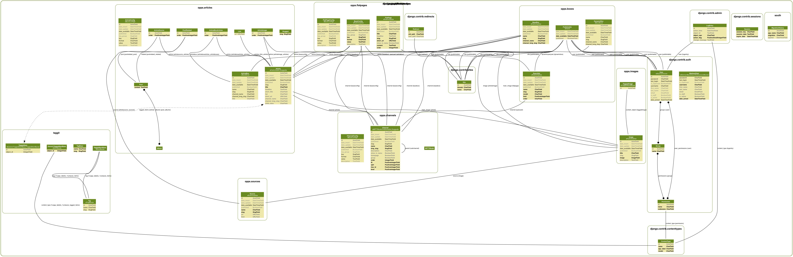

Contributing
============

Contributions are very welcome. Specially roles. If you implement a role that you think others might be using, please contribute.

To contribute head to `opps's github page <https://github.com/opps/opps>`_, fork it and create a pull request.

Developing
----------

We strive to keep the internal quality of opps to the best that we can;
Therefore, it's very important to keep some things in mind when contributing with code for opps:

* Test everything you can, with automated tests. If possible, please develop code with `TDD <http://en.wikipedia.org/wiki/Test-driven_development>`_.
  If you're having a hard time building tests, don't hesitate to ask for help in the `opps mailing list <http://groups.google.com/group/opps-developers>`_.
  We are happy to help you keep your code well-covered by tests;

* When writing actual code, follow the conventions in `PEP 8 <http://www.python.org/dev/peps/pep-0008/>`_
  (except for `maximum line length <http://www.python.org/dev/peps/pep-0008/#maximum-line-length>`_,
  which we don't follow because there are too many parts of the project that require large strings to be used);

* When writing docstrings, follow the conventions in `PEP 257 <http://www.python.org/dev/peps/pep-0257/>`_
  (take a look at other docstrings in the project to get a feel of how we organize them);

  - Also, when writing docstrings for the API, provide examples of how that method or class works.
    Having a code example of a part of the API is really helpful for the user.

Developer Setup
---------------

Software required in OS:

* Redis Server
* SQLite
* Image Lib

Check out the code from the `github project`_::

    git clone git://github.com/opps/opps.git
    cd opps

Create a `virtualenv`_ (the example here is with `virtualenvwrapper`_) and install all development packages::

    mkvirtualenv opps
    pip install -r requirements_dev.txt
    python setup.py develop

Here is how to run the test suite::

    make test

Here is how to build the documentation::

    cd docs
    make html

Architecture
------------

The team
--------

The core team
*************

The core team behind **opps** (in order of joining the project):

* `Thiago Avelino <https://github.com/avelino>`_ (technical leader of this project)
* `Bruno Rocha <https://github.com/rochacbruno>`_
* `Patches and suggestions <https://github.com/orgs/opps/members>`_

Other contributors
******************

Other non-core members, but equally important, equally rocking, equally ass-kicking contributors can be seen in this list:
https://github.com/opps/opps/network/members

There are also some more contributors that haven't send code to the project, but who help in other ways, when and how they can.
We're very happy to have you, guys!

.. _`github project`: https://github.com/opps/opps
.. _virtualenv: http://www.virtualenv.org/
.. _virtualenvwrapper: http://virtualenvwrapper.readthedocs.org/

Add member on TEAM
******************

Clone repo `oppsproject.org <https://github.com/opps/oppsproject.org>`_ and add user on `permissions.cfg <https://github.com/opps/oppsproject.org/blob/master/permissions.cfg>`_ in *[team:contributors]*
